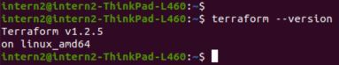
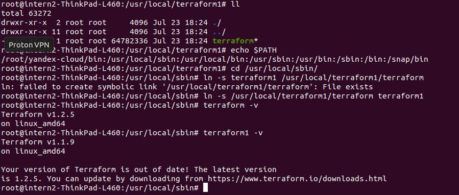

# ДЗ 7.1 Инфраструктура как код

## Задача 1

Через час совещание на котором менеджер расскажет о новом проекте. Начать работу над которым надо будет уже сегодня. 
На данный момент известно, что это будет сервис, который ваша компания будет предоставлять внешним заказчикам.
Первое время, скорее всего, будет один внешний клиент, со временем внешних клиентов станет больше.

Так же по разговорам в компании есть вероятность, что техническое задание еще не четкое, что приведет к большому количеству небольших релизов,
тестирований интеграций, откатов, доработок, то есть скучно не будет.

Вам, как девопс инженеру, будет необходимо принять решение об инструментах для организации инфраструктуры.
На данный момент в вашей компании уже используются следующие инструменты:

- остатки Сloud Formation,
- некоторые образы сделаны при помощи Packer,
- год назад начали активно использовать Terraform,
- разработчики привыкли использовать Docker,
- уже есть большая база Kubernetes конфигураций,
- для автоматизации процессов используется Teamcity,
- также есть совсем немного Ansible скриптов,
- и ряд bash скриптов для упрощения рутинных задач.

Для этого в рамках совещания надо будет выяснить подробности о проекте, что бы в итоге определиться с инструментами:

1. Какой тип инфраструктуры будем использовать для этого проекта: изменяемый или не изменяемый?
2. Будет ли центральный сервер для управления инфраструктурой?
3. Будут ли агенты на серверах?
4. Будут ли использованы средства для управления конфигурацией или инициализации ресурсов?

В результате задачи необходимо
- Ответить на четыре вопроса представленных в разделе "Легенда".
5. Какие инструменты из уже используемых вы хотели бы использовать для нового проекта?
6. Хотите ли рассмотреть возможность внедрения новых инструментов для этого проекта?
7. Если для ответа на эти вопросы недостаточно информации, то напишите какие моменты уточните на совещании.

### Ответ

.5. и 6. если у заказчика не будет особых требований к используемым инструментам, предлагаю максимально использовать средства, 
которые уже привыкли использовать в команде, это менее ресурсозатратно.

.1. неизменяемая структура - удобно разворачивать песочницы с аналогом архитектуры будущих серверов, постоянный повторяемый резльтат, плюс "со временем внешних клиентов станет больше"   
.2. и 3. Будет ли центральный сервер для управления инфраструктурой? и Будут ли агенты на серверах? - тут зависит от средств, которые мы будем использовать, 
если у заказчика нет иных требований. Ansible и Terraform - не требуют агентов и центрального сервера.

.7. вопросы к заказчику:
- какие ресурсы будут использоваться, глобальные или локальные облака, реальное железо с виртуалками, реальные машины с ОС?
- кто будет их поддерживать и какой объем задач именно для нашей команды, возможно у заказчика уже есть часть инфраструктуры/конкретные облака, реальные машины с сисадминами и тд?
Если есть часть своих, то надо будет делать рабочие песочницы аналогичных реальных машин (возможно образы не делать тем же Packer, а снять с машин заказчика) 

.4. Если нет никаких конкретных ограничений предлагаю использовать:
- образы машин Packer
- управление ПО - Ansible; также существующие скрипты на bash, если они будут необходимы, можно перевести в Ansible; его предлагаю использовать в случае, если машины и ОС админятся не нами, а работаем на машинах заказчика
- контейнеры Docker
- оркестрация Kebernetes
- по системам инициализации ресурсов - если будут использоваться облака, то брать Terraform, так как с учетом конкретики задания: "его начали активно использовать", а не "остатки Сloud Formation"

## Задача 2. Установка терраформ.

Официальный сайт: https://www.terraform.io/

Установите терраформ при помощи менеджера пакетов используемого в вашей операционной системе.
 В виде результата этой задачи приложите вывод команды terraform --version.

## Задача 3. Поддержка легаси кода.
В какой-то момент вы обновили терраформ до новой версии, например с 0.12 до 0.13.
 А код одного из проектов настолько устарел, что не может работать с версией 0.13.
 В связи с этим необходимо сделать так, чтобы вы могли одновременно использовать последнюю 
 версию терраформа установленную при помощи штатного менеджера пакетов и устаревшую версию 0.12.

В виде результата этой задачи приложите вывод --version двух версий терраформа доступных на вашем 
компьютере или виртуальной машине.

Я скачала архив с пердыдущей версией, развернула его, посмотрела echo $PATH, пошла в первую в списке директорию, сделала там ссылку terrafotm1 на terraform предыдущей версии. 

