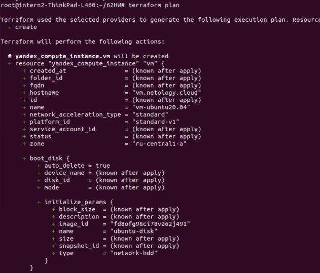
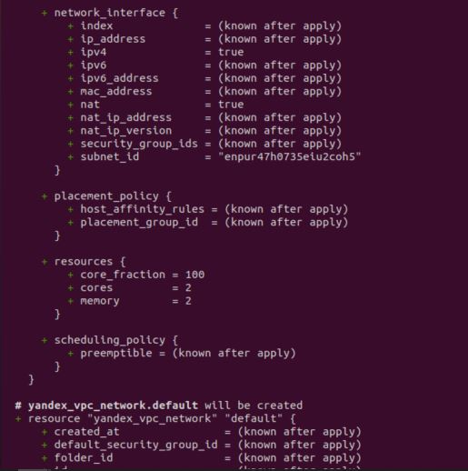
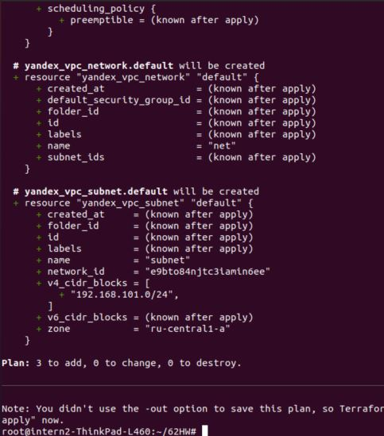

# ДЗ 7.2 Инфраструктура как код

## Задача 1. Вариант с Yandex.Cloud. Регистрация в ЯО и знакомство с основами

сделано

## Задача 2. Создание yandex_compute_instance через терраформ.

я взяла id образа ubuntu_20.04_TLS из yandex cloud marketplace, сеть и подсеть создавала вручную и вставила их id в main.tf
команда terraform plan выполняется без ошибок

## Вопросы.

### 1. При помощи какого инструмента (из разобранных на прошлом занятии) можно создать свой образ ami?

Можно сделать с помощью Packer и Vagrant

### 2. Ссылку на репозиторий с исходной конфигурацией терраформа.

https://github.com/eksenof/devops-netology/blob/main/IaC/72HW/main.tf