# Домашнее задание к занятию "08.03 Работа с Roles"

1. Создать в старой версии playbook файл `requirements.yml` и заполнить его следующим содержимым:
2. При помощи `ansible-galaxy` скачать себе эту роль. Запустите  `molecule test`, посмотрите на вывод команды.
	
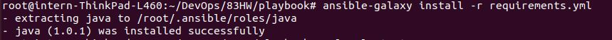   
   
   
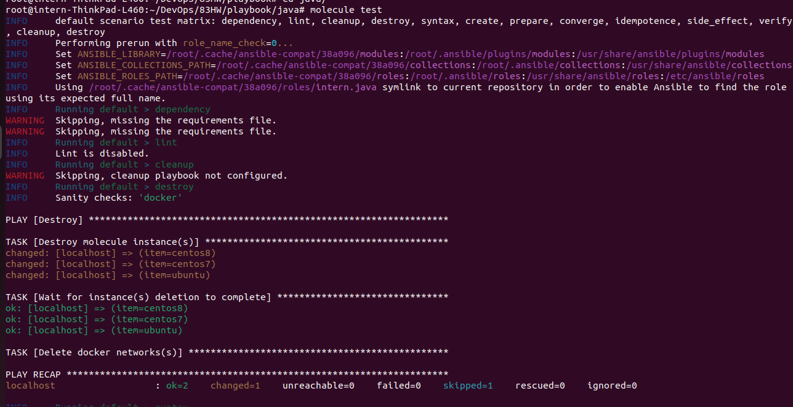
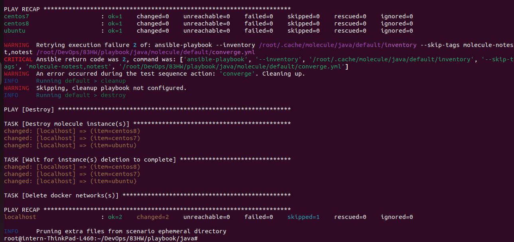

3. Перейдите в каталог с ролью elastic-role и создайте сценарий тестирования по умолчаню при помощи `molecule init scenario --driver-name docker`.

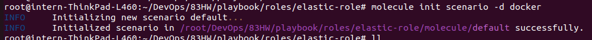

4. Добавьте несколько разных дистрибутивов (centos:8, ubuntu:latest) для инстансов и протестируйте роль, исправьте найденные ошибки, если они есть.

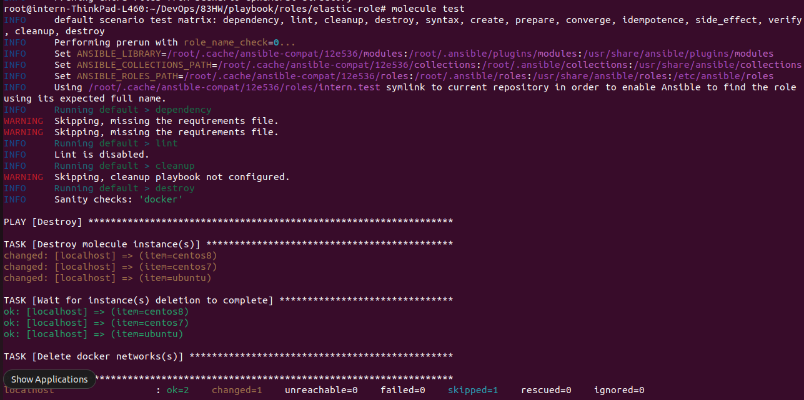
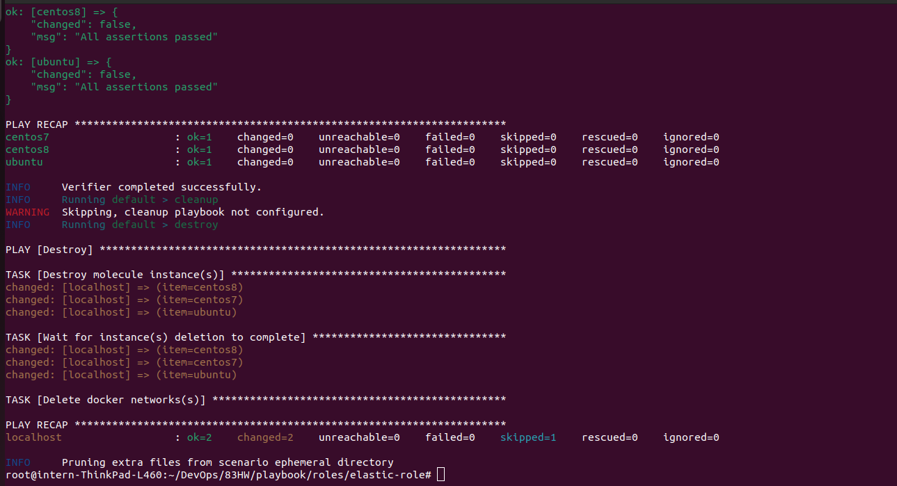

5. Создайте новый каталог с ролью при помощи `molecule init role --driver-name docker kibana-role`. Можете использовать другой драйвер, который более удобен вам.

так не давал создать, видимо, новые правила названий ролей, сделала, как он просил:   

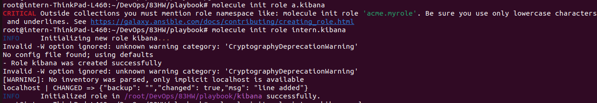

для работы molecule поправила файлики meta/main.yml   

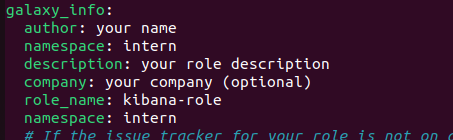

6. На основе tasks из старого playbook заполните новую role. Разнесите переменные между `vars` и `default`. Проведите тестирование на разных дистрибитивах (centos:7, centos:8, ubuntu).

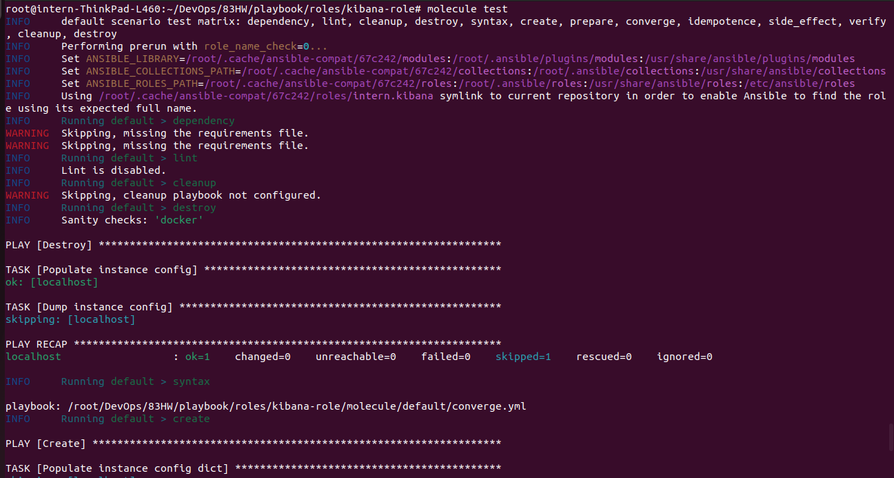
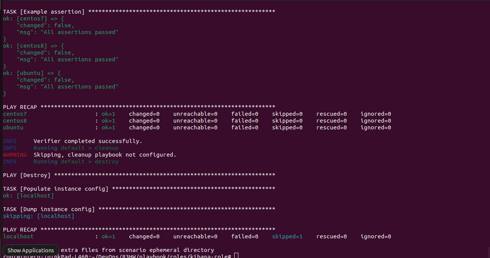

7. Выложите все roles в репозитории. Проставьте тэги, используя семантическую нумерацию.

всем сделала tag 1.0.0

[java-role](https://github.com/eksenof/java-role)   
[elastic-role](https://github.com/eksenof/elastic-role)   
[kibana-role](https://github.com/eksenof/kibana-role)   

8. Добавьте roles в `requirements.yml` в playbook. 

[requirements.yml](https://github.com/eksenof/devops-netology/tree/main/ansible/83HW/playbook/requirements.yml)

9. Переработайте playbook на использование roles.

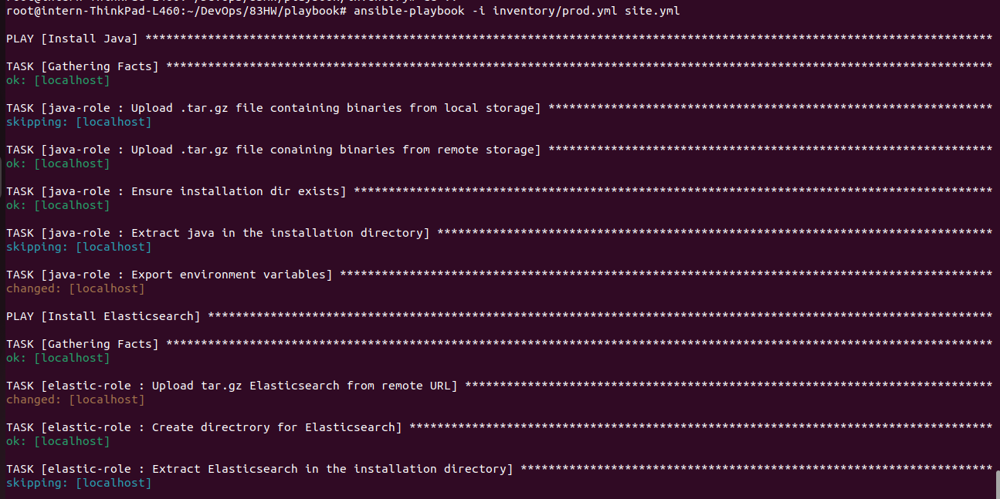
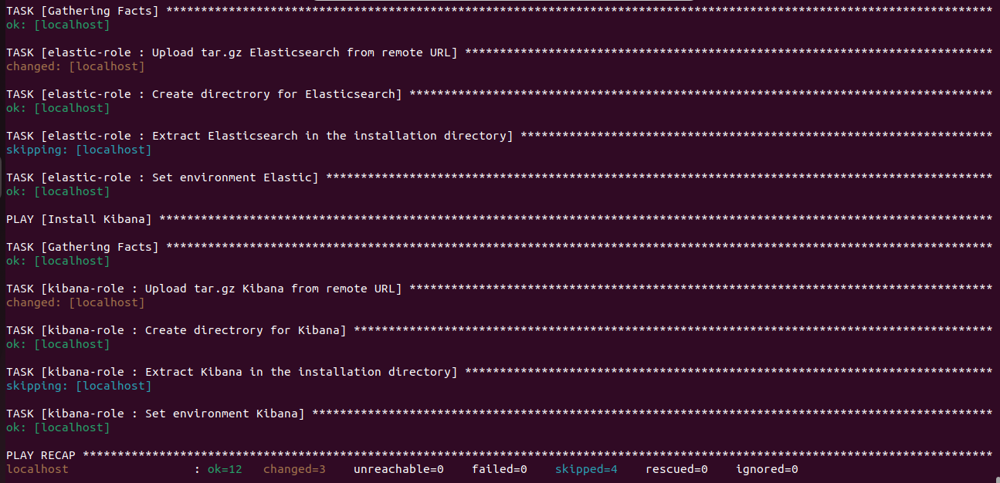

10. Выложите playbook в репозиторий.

[playbook](https://github.com/eksenof/devops-netology/tree/main/ansible/83HW/playbook)

