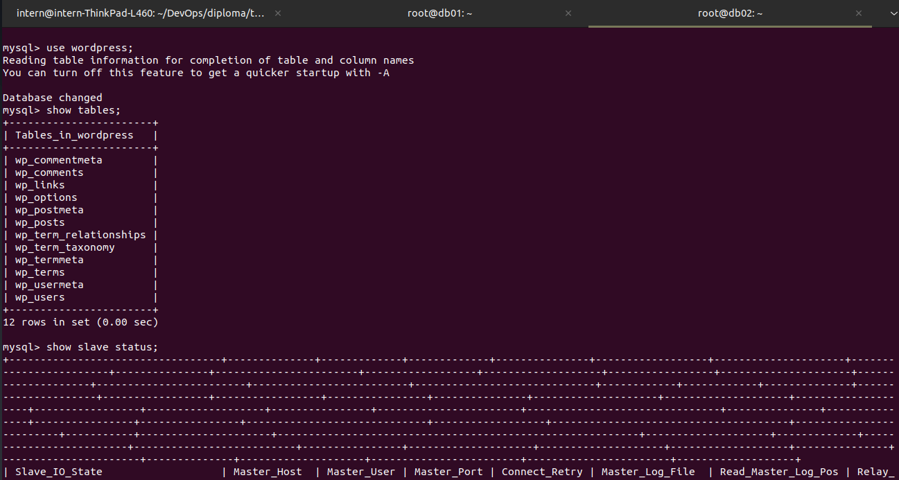

# Дипломный практикум в YndexCloud
Ксенофонтова Евгения

Полное задание можно посмотреть [здесь](https://github.com/olegbukatchuk/devops-diplom-yandexcloud/blob/main/README.md)


## Подготовка к запуску проекта
1. Для настройки доступа к машинам из внутренней сети по ssh на машине, откуда запускается проект необходимо прописать в файле ~/.ssh/config:

```
Host 192.168.1.*  
    ProxyJump eksen.space
```
2. Нужно прописать данные Яндекс облака в файле terraform/main.tf  
3. Поместить в папку terraform файлы для настройки ssh: key.json и ssh-key, в проекте лежат шаблоны.


## Общие сведения

Доменное имя зарегистрировано через reg.ru c названием eksen.space.   
dns записи прописаны YandexCloud.


бэкэнд я использовала S3 bucket в YandexCloud из ДЗ.


wokrspace stage


Полный запуск проекта занимает от 35 минут до часа. Полный лог выполнения можно посмотреть [тут](src/diploma_process.txt).  
В работе используется один забронированный в яндексе статический адрес 62.84.116.169.  
Зона dns и A-записи создаются автоматически.  


Краткая таблица параметров машин и приложений:  


## Nginx и LetsEncrypt

На машине nle есть внешний и внутренний адреса, она является прокси ssh, прокси для доступа в интернет с машин и прокси извне для web-интерфейсов на машинах.

Для настройки доступа в интернет с внутренних машин использована роль proxy, которая прописывает в apt_proxy.conf настройки доступа по http и https. 
Также она добавляет в файл hosts на машинах друг друга.

http - порт 8888  через nginx  
https - порт 3128  через squid (не смогла настроить через nginx, пришлось установить squid для доступа по https)  

Порты также настроены в nginx для доступа извне и изнутри.   
В связи с тем, что количество раз выписывания сертификатов LetsEncrypt ограничено, для отработки задания в роль добавила скачивание сертификатов с локальной машины.  
В проекте данные строки закомментированы, папку с сертификатами загружать в репозиторий не стала.   


## MySQL

Репликация настроена, база данных wordpress и пользователь wordpress создаются автоматически.   
Разнесла роли: 
- MySQL - установка одинаковая для обеих машин, 
- master и slave - задачи соответственно роли.





## Wordpress

Роль Wordpress устанавливает wordpress и nginx, настраивает связь с бд на db01, после установки можно зайти по адресу www.eksen.space и вручную сделать первичную установку через web-интерфейс.
В процессе работы было получено сообщение - слишком много запросов на скачивание дистрибутива wordpress, сделала локальную загрузку архива для отработки. 
В итоговой версии данные строки закомментированы, папку с дистрибутивом загружать не стала.


## Gitlab CE и Gitleb Runner

Роли gitlab и runner настраивают соответствующие приложения на машинах. Машине для гитлаба пришлось увеличить размер диска, тк была ошибка о нехватке места при разворачивании 
скаченного дистрибутива, итого 10Гб.  
Первоначальную настройку гитлаба, добавление раннера и pipeline делаю через web-интерфейс. Мне не хватает знаний по внутреннему устройству wordpress, но вроде по заданию этого и не требуется, 
поэтому настроила простое копирование файлов при коммите в гитлаб в папку на машине wordpress по адресу:   
/var/www/wordpress/eksen.space
Файл pipeline лежит внутри роли gitlab/templates/pipleine.yml


## Prometheus, AlertManager, NodeExporter, Grafana

Cозданы соответствующие роли:
- node_ex устанавливается на все машины,
- остальные три роли на машину monitoring. По соответствующему названию можно попасть в web-интерфейс приложений.  
В графане добавлены стандартные панели для прометеуса N 1860 и N 3662.


погасила одну машину через web-интерфейс яндекса, чтобы было видно, что алёртменеджер это увидит.


## Заключение
 Дипломное практическое задание принципиально выполнено, все поставленные задачи выполнены. Конечно, для реальной работы необходима большая доработка. 
 При работе над проектом было очень много неожиданных мелких проблем и задач, с первого взгляда не связанных напрямую с заданием.
 Это было достаточно сложно, очень поучительно и в какой-то мере даже интересно. Спасибо за внимание!
 
 В работе использованы открытые источники и роли, из них не удаляла meta, чтобы было видно откуда взят исходник.