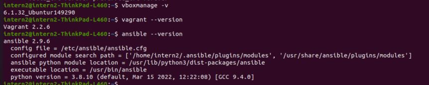

# ДЗ "5.2. Применение принципов IaaC в работе с виртуальными машинами"

## 1.
Опишите своими словами основные преимущества применения на практике IaaC паттернов.
- быстрее чем вручную создание, расширение, адаптация среды
- постоянство конфигураций при внесении изменений в настройки различных машин
- один раз создали шаблоны и можно легко и быстро разворачивать-изменять-убирать машины в зависимости от задач без привлечения админа/девопса
в итоге: быстрота и стабильность

Какой из принципов IaaC является основополагающим?  
повторяемость результата при повторении выполнения

## 2.
Чем Ansible выгодно отличается от других систем управление конфигурациями?  
использует существующую ssh связь, за счет чего достигается скорость начала работы, работаем с тем, что уже есть, не нужна дополнительная интеграция,
простота описания конфигурация, легко масштабируется и трансформируется. использует push метод, что позволяет распределить во времени отправку конфигураций

Какой, на ваш взгляд, метод работы систем конфигурации более надёжный push или pull?  
в лекции был приведен пример одновременного обращения множества машин к серверу конфигации, что замедлило его работу. поэтому в данном случае стабильнее будет push.
также не обязательно иметь публично доступную главную машину для удаленной настройки узлов - это узлы должны быть доступны. надо смотреть по ситуации.

## 3.
Установить на личный компьютер:
- VirtualBox
- Vagrant
- Ansible

Приложить вывод команд установленных версий каждой из программ, оформленный в markdown.

```
sudo apt install vagrant
sudo apt install ansible
sudo apt install virtualbox virtual-box-pack
```




## 4*.
Воспроизвести практическую часть лекции самостоятельно.
Создать виртуальную машину.
Зайти внутрь ВМ, убедиться, что Docker установлен с помощью команды


