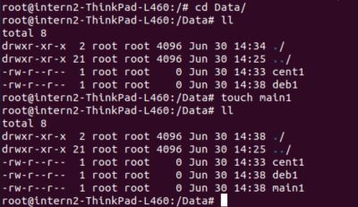

# ДЗ "5.3 Введение. Экосистема. Архитектура. Жизненный цикл Docker контейнера"

## 1. Сценарий выполения задачи:

создайте свой репозиторий на https://hub.docker.com;
выберете любой образ, который содержит веб-сервер Nginx;
создайте свой fork образа;
реализуйте функциональность: запуск веб-сервера в фоне с индекс-страницей, содержащей HTML-код ниже:

```
<html>
<head>
Hey, Netology
</head>
<body>
<h1>I’m DevOps Engineer!</h1>
</body>
</html>
```

Опубликуйте созданный форк в своем репозитории и предоставьте ответ в виде ссылки на https://hub.docker.com/username_repo.

### Ответ:

 
   
https://hub.docker.com/layers/devops-netology/eksenof/devops-netology/nginx0.2/images/sha256-5da55f5dd6c70ff93190bc9d1a8f4ea23d6ac856c6c571ca955c55b9e8059297?context=repo


## 2. Посмотрите на сценарий ниже и ответьте на вопрос: "Подходит ли в этом сценарии использование Docker контейнеров или лучше подойдет виртуальная машина, физическая машина?
Может быть возможны разные варианты?" Детально опишите и обоснуйте свой выбор.

### Ответы:

 
Ни с одним из данных пунктов не работала, максимум названия слышала. Описала как поняла из описаний продуктов.

- Высоконагруженное монолитное java веб-приложение - тк одно и высоконагруженное, лучше использовать физическую машину или аппаратную виртуализацию, чтобы было разделение ресурсов. 

- Nodejs веб-приложение - насколько я поняла Node.js - это среда для разработчиков, пишущих на java. такая задача подходит для контейнеризации,невысоконагруженная, легко развернуть, можно сделать сколько надо копий, и каждому своё пространство

- Мобильное приложение c версиями для Android и iOS - так как других данных нет, полагаю, что раз приложение мобильное, значит основные требования именно к сети и доступу. Я бы взяла реальную машину/аппаратную виртуализацию, чтобы полностью контролировать сетевые ресурсы

- Шина данных на базе Apache Kafka - используется горизонтальная масштабируемость, при добавлении новых хостов, легко использовать контенеры, чтобы всё не настраивать полностью.

- Elasticsearch кластер для реализации логирования продуктивного веб-приложения - три ноды elasticsearch, два logstash и две ноды kibana - 
похоже на предыдущий вариант, много текстовых сообщений, кластеризация, отказоустойчивость. Контейнеризация подошла бы.

- Мониторинг-стек на базе Prometheus и Grafana - контейнеры или паравиртуализация, чтобы можно было легко перенести на другую машину, масштабировать железо, забэкапить и восстановить предыдущую конфигурацию.

- MongoDB, как основное хранилище данных для java-приложения - я бы использовала реальную машину или аппаратную виртуалку, чтобы не делить ни с кем физические ресурсы.

- Gitlab сервер для реализации CI/CD процессов и приватный (закрытый) Docker Registry - физическую машину или аппаратную виртуалку, чтобы избежать накладных затрат на поддержку ОС, затраты на деленеие ресурсов сети, диска,
 обеспечить доступность 24/7 и всякое бэкапирование.

 
 
## 3. 
 Запустите первый контейнер из образа centos c любым тэгом в фоновом режиме, подключив папку /data из текущей рабочей директории на хостовой машине в /data контейнера; 
 Запустите второй контейнер из образа debian в фоновом режиме, подключив папку /data из текущей рабочей директории на хостовой машине в /data контейнера; 
 Подключитесь к первому контейнеру с помощью docker exec и создайте текстовый файл любого содержания в /data; Добавьте еще один файл в папку /data на хостовой машине; 
 Подключитесь во второй контейнер и отобразите листинг и содержание файлов в /data контейнера.
 
 
docker run -t centos
docker run -d -v /Data:/Data --name cent -t centos


создала файл из первого контейнера cent1:   
   
создала файл из второго контейнера deb1:   
 
   
создала файл из основной машины main1:   

 
 


## 4. Воспроизвести практическую часть лекции самостоятельно.

Соберите Docker образ с Ansible, загрузите на Docker Hub и пришлите ссылку вместе с остальными ответами к задачам.


### сборка образа:
 

ссылка на Docker:

 https://hub.docker.com/r/eksenof/ansible/tags
 
 
 
 ## Доработка задание 1
 Как вы заменили стартовую страницу nginx?
 
 я создала файлик index.html на основной машине, скопировала туда текст из задачи, посмотрела название контейнера (charming_blackwell) и скопировала файл с основной машины с помощью:
 ```
 docker cp index.html charming_blackwell:/usr/share/nginx/html
 ```