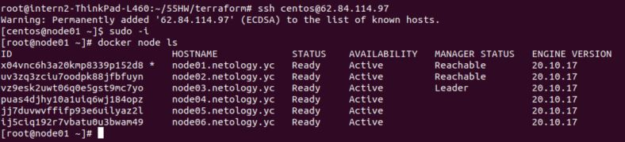
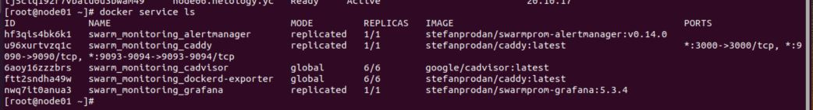
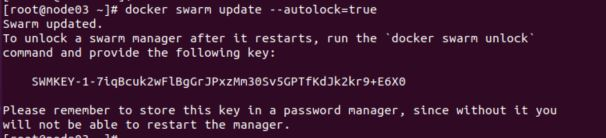

# Задание - 5.5. Оркестрация кластером Docker контейнеров на примере Docker Swarm

## Задача 1 

Дайте письменые ответы на следующие вопросы:
- В чём отличие режимов работы сервисов в Docker Swarm кластере:  replication и global?   
global - разворачивается на каждой машине, replicated - только указанное количество экземпляров.
- Какой алгоритм выбора лидера используется в Docker Swarm кластере?   
Ralf алгоритм, работает по принципу голосования:
ноды ждут хардбит от лидера,
если не получают его заданное время, переходят в статус "кандидат" и отправляют заявку на лидерство,
получив эту заявку другие хосты не в состоянии "кандидат" отправляют согласие в ответ,
кто получает больше согласий, становится лидером - начинает рассылать всем хардбит
если вдруг два хоста стали кандидатами одновременно и получили одинаковое количество согласий,
они начинают отсчет времени ожидания до изменения статуса в кандидаты сначала
- Что такое Overlay Network?   
overlay network - вид логической сети, настраеваемый поверх физической или логической сети,
работает как надстройка над обычными стандартными сетевыми протоколами. классический пример - vpn.
В нашем случае такая логическая надстройка создаёт сеть кластера, через которую общаются контейнеры.

## Задача 2

Создать ваш первый Docker Swarm кластер в Яндекс.Облаке
Для получения зачета, вам необходимо предоставить скриншот из терминала (консоли), с выводом команды:
docker node ls

## Задача 3

Создать ваш первый, готовый к боевой эксплуатации кластер мониторинга, состоящий из стека микросервисов.
Для получения зачета, вам необходимо предоставить скриншот из терминала (консоли), с выводом команды:
docker service ls

## Задача 4 (*)
Выполнить на лидере Docker Swarm кластера команду (указанную ниже) и дать письменное описание её функционала,
что она делает и зачем она нужна:
см.документацию: https://docs.docker.com/engine/swarm/swarm_manager_locking/
docker swarm update --autolock=true

команда включения системы защиты ключей TLS для swarm, так как они по умолчанию хранятся в незашифрованном виде.
Но при перезапуске служб необходима разблокировка, так как сервис уйдёт в ошибку.

